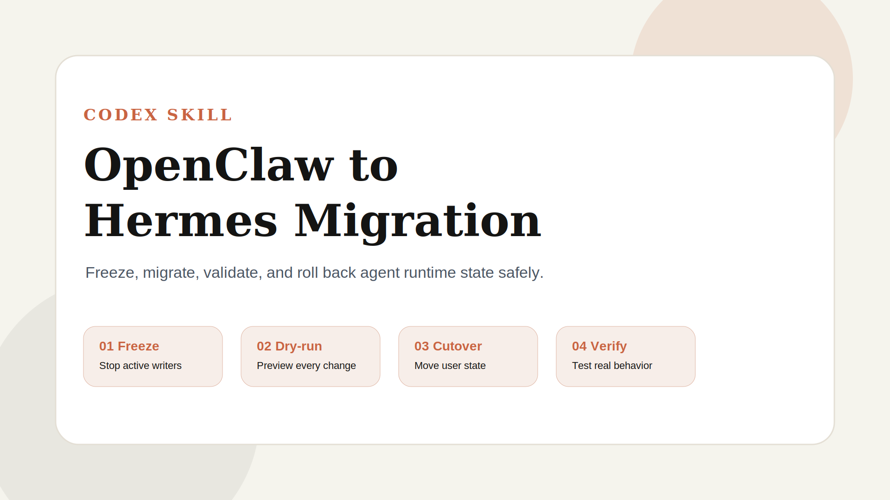
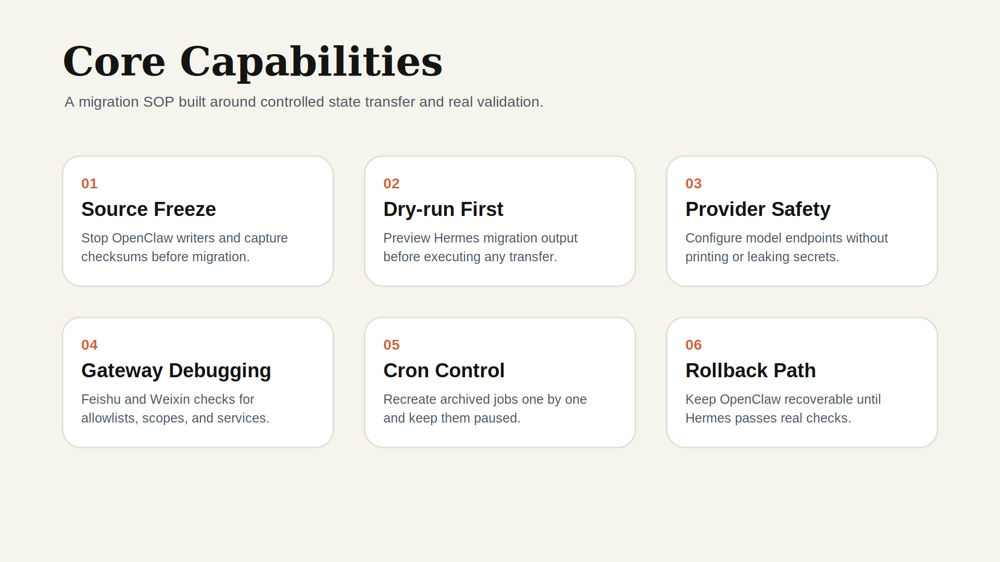
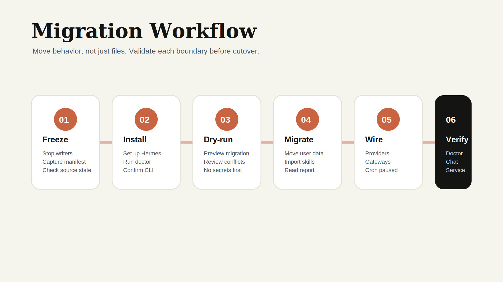

<div align="center">

# OpenClaw to Hermes Migration

**A production-safe Codex skill for migrating OpenClaw workspaces to Hermes Agent**



[](./LICENSE)
[](./SKILL.md)
[](./SKILL.md)
[](./evals/evals.json)

</div>

---

## What This Is

OpenClaw to Hermes Migration is a Codex skill that turns a risky agent-runtime migration into a staged, verifiable operating procedure. It preserves the parts that matter: identity, memory, skills, provider configuration, messaging gateways, cron intent, and rollback safety.

The skill is designed for real cutovers where OpenClaw may still be writing runtime files, Hermes must be configured with new model providers, and messaging channels such as Feishu or Weixin need to keep working after migration.

```text
Input:  An existing ~/.openclaw installation with skills, memory, providers, gateways, and cron jobs
Output: A verified ~/.hermes setup with imported user data, tested provider access, gateway service, and rollback path
```

---

## Core Capabilities



The SOP emphasizes behavior preservation over blind file copying. It uses dry-runs, checksums, explicit backups, non-secret inspection commands, and acceptance checks before treating Hermes as the replacement runtime.

---

## Migration Workflow



The workflow keeps OpenClaw recoverable until Hermes passes real capability checks. Provider and gateway steps are intentionally separate from user-data migration so secrets and channel permissions can be handled explicitly.

---

## Installation

Install this repository as a local Codex skill by copying or cloning it into your skills directory:

```bash
mkdir -p ~/.agents/skills
git clone git@github.com:geekjourneyx/openclaw-to-hermes-migration.git ~/.agents/skills/openclaw-to-hermes-migration
```

If your Codex setup uses a different skills path, place this repository under that path and keep the directory name `openclaw-to-hermes-migration`.

---

## Quick Start

Ask Codex to use the skill during an OpenClaw migration:

```text
$openclaw-to-hermes-migration
Migrate ~/.openclaw to Hermes Agent. Preserve skills, memory, Feishu, Weixin, z.ai/BigModel provider config, cron jobs, and rollback.
```

For provider-only work:

```text
Use the OpenClaw to Hermes migration skill to switch Hermes to a domestic z.ai/BigModel endpoint. Do not print secrets and only remove old providers I explicitly name.
```

For Feishu debugging:

```text
Hermes gateway connects to Feishu but messages get no replies. Logs mention Unauthorized user and im:chat:readonly. Debug the migration.
```

---

## What The Skill Covers

- Freeze OpenClaw safely before migration and verify no active writers remain.
- Capture source manifests and non-secret summaries for auditability.
- Install Hermes and handle non-interactive installer edge cases.
- Run `hermes claw migrate` in dry-run mode before executing migration.
- Migrate user data before secrets to reduce blast radius.
- Configure generic OpenAI-compatible providers and z.ai/BigModel as a concrete example.
- Migrate Feishu and Weixin configs only when source settings exist.
- Debug Feishu allowlists, app scopes, group policies, and gateway logs.
- Recreate OpenClaw cron jobs without assuming a single `jobs[0]` entry.
- Keep cron jobs paused until model auth and delivery channels are proven.
- Preserve rollback through a stopped Hermes gateway and restartable OpenClaw service.

---

## Repository Layout

```text
.
├── SKILL.md
├── evals/
│   └── evals.json
├── references/
│   └── migration-session-summary.md
├── assets/
│   ├── banner.svg
│   ├── features.svg
│   └── workflow.svg
├── LICENSE
└── README.md
```

---

## Validation

The bundled eval file covers the migration scenarios this skill must continue to handle:

```bash
python3 -m json.tool evals/evals.json
```

Before changing the SOP, verify that the updated instructions still cover:

- Safe OpenClaw freeze, manifest capture, dry-run, execution, validation, and rollback.
- Feishu gateway debugging for unauthorized senders and missing chat scopes.
- z.ai/BigModel configuration without leaking secrets or removing unrelated providers.
- Missing Feishu or Weixin source config without crashing the migration.
- Multiple archived cron jobs without assuming `jobs[0]`.

---

## License

[MIT](./LICENSE) - free to use, modify, and distribute.

---

## Author

| | |
|:---|:---|
| 个人主页 | [jieni](https://jieni.ai) |
| GitHub | [geekjourneyx](https://github.com/geekjourneyx) |
| Twitter | [@seekjourney](https://x.com/seekjourney) |
| 公众号 | 微信搜「极客杰尼」 |
